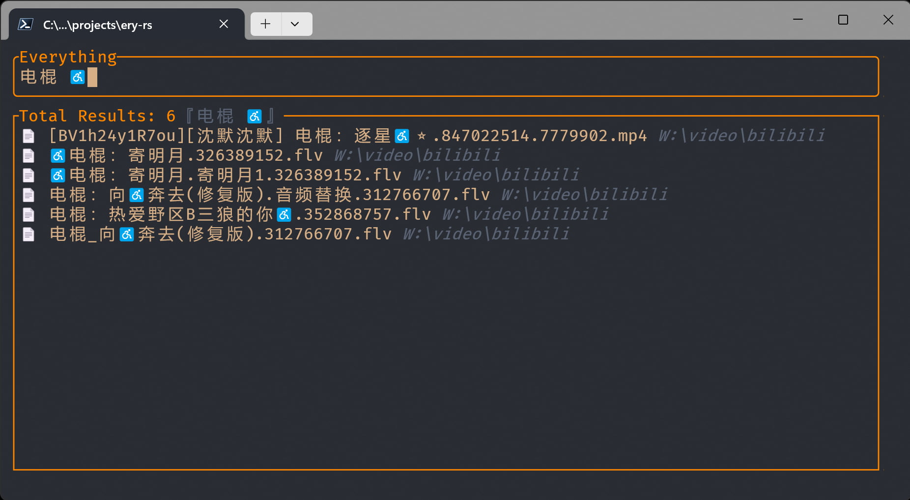

# 『ery』

> [Everything](https://www.voidtools.com/) frontend for Windows file searching with UI by IPC, but in Terminal.

## Demo

## Why

The only thing supported now is _simple searching_ like Everything.exe GUI.

But the [`everything-sdk`](https://crates.io/crates/everything-sdk) crate can do much more things for us, so more features will come.

## Install

In Windows (of course), get it by Cargo.

`> cargo install ery`

## Usage

Run your `Everything.exe` in background, then run command `ery`.

## License

This project use the [GPLv3 License](https://www.gnu.org/licenses/gpl-3.0.html).
